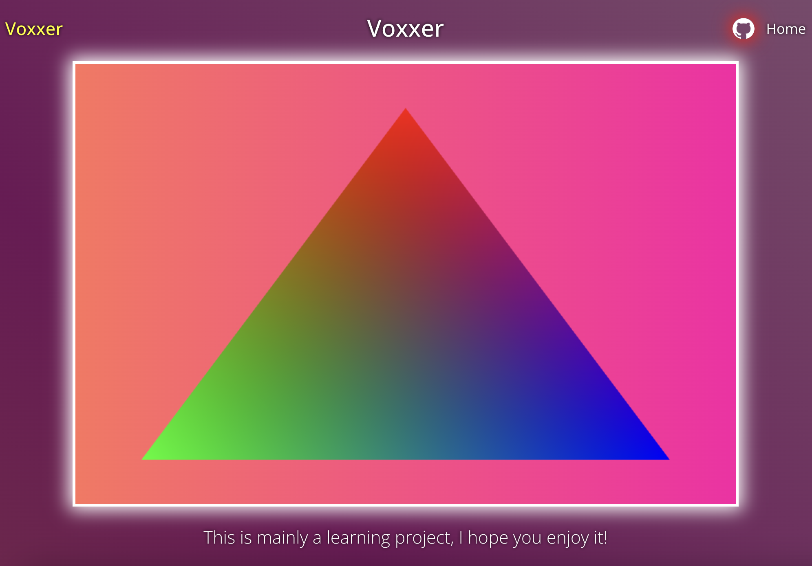

# WebGL 3D Scaffold

A minimal WebGL 1.0 starter project built with **TypeScript** and **Vite**. It renders an interpolated-color triangle and provides a clean architecture you can extend into a full 3D application.

<p align="center">
  
</p>

## Quick Start

**Prerequisites:** [Node.js](https://nodejs.org/) (v18+) and npm.

```bash
npm install      # install dependencies
npm run dev      # start Vite dev server (opens localhost:5173)
npm run build    # production build → dist/
```

## Tauri 2 Desktop Wrapper

This project is now wrapped with a **Tauri 2** app shell while keeping the
existing Vite + frontend code in place (minimal relocation approach).

### Prerequisites

Follow the official Tauri 2 prerequisites for your OS:

- https://v2.tauri.app/start/prerequisites/

### Run as desktop app

```bash
bun install
bun run tauri:dev
```

### Build desktop bundles

```bash
bun run tauri:build
```

### Project additions

- `src-tauri/` Rust host app and Tauri config
- `src-tauri/tauri.conf.json` with Vite hooks (`beforeDevCommand`,
  `beforeBuildCommand`, `devUrl`, `frontendDist`)
- `src-tauri/capabilities/default.json` permissions for `dialog` + `fs`

### Notes

- Vite config follows official Tauri guidance for fixed dev port, strict port,
  `TAURI_DEV_HOST`, HMR settings, and `src-tauri` watch ignore.
- Existing web entrypoints and source layout stay unchanged.

## Tech Stack

| Tool           | Purpose                                   |
| -------------- | ----------------------------------------- |
| **TypeScript** | Type-safe source code                     |
| **Vite**       | Dev server with hot-reload & bundling     |
| **gl-matrix**  | Fast vector / matrix math (vec3, mat4, …) |
| **WebGL 1.0**  | Browser-native 3D graphics API            |

## Project Structure

```
src/
├── main.ts              Entry point – gets the WebGL context, starts the renderer
├── canvas.ts            Creates <canvas> and obtains WebGLRenderingContext
├── renderer.ts          Core render loop (Start → Update via requestAnimationFrame)
├── renderer-utils.ts    Shader compilation & program linking helpers
├── shader-materials.ts  Imports GLSL files and groups them into material objects
├── time-manager.ts      Static Time class – deltaTime, elapsed time, FPS
├── messages.ts          DOM helpers (title, nav bar)
├── style.css            Page styles
└── shaders/
    ├── unlit/            Vertex + Fragment shader (vertex colors, model matrix)
    └── texture/          Vertex + Fragment shader (texture sampling)
```

## How It Works — Step by Step

If you're new to WebGL, here is the journey a single frame takes through this codebase:

### 1. Obtain a WebGL Context (`canvas.ts`)

A `<canvas>` element is already in `index.html`. `initializeCanvas()` calls `canvas.getContext("webgl")` to get a `WebGLRenderingContext` — the object through which every WebGL call is made.

### 2. Configure Render State (`renderer.ts → RenderingSettings`)

Before drawing anything the renderer sets a few global GPU states:

- **Viewport** — maps clip-space (−1…1) to the canvas pixel dimensions.
- **Depth test** — ensures closer triangles draw on top of farther ones.
- **Back-face culling** — skips triangles facing away from the camera (counter-clockwise winding = front).

### 3. Compile Shaders (`renderer-utils.ts`)

WebGL requires two small GPU programs written in **GLSL**:

| Shader              | Runs once per… | Job                                                                          |
| ------------------- | -------------- | ---------------------------------------------------------------------------- |
| **Vertex shader**   | vertex         | Transforms 3D positions into clip-space; passes color to the fragment stage. |
| **Fragment shader** | pixel          | Outputs the final color for each pixel inside the triangle.                  |

`CompileShaderSource()` compiles GLSL source text into a shader object. `CreateShaderProgram()` links a vertex + fragment shader into a _program_ the GPU can execute.

> GLSL source files live under `src/shaders/` and are imported as raw strings via Vite's `?raw` suffix (see `shader-materials.ts`).

### 4. Upload Geometry & Attributes (`renderer.ts → Start`)

Geometry data lives in plain `Float32Array`s. The scaffold defines a single triangle:

```
Positions          Colors (RGB)
 0.0,  0.8, 0.0   1, 0, 0  (red)
-0.8, -0.8, 0.0   0, 1, 0  (green)
 0.8, -0.8, 0.0   0, 0, 1  (blue)
```

Each array is uploaded to the GPU via a **buffer** (`gl.createBuffer` → `gl.bufferData`), then connected to the corresponding shader `attribute` with `gl.vertexAttribPointer`.

### 5. Set Uniforms

**Uniforms** are values that stay constant for every vertex/pixel in one draw call:

- `u_resolution` — canvas width & height
- `u_color` — a fallback flat colour
- `u_modelMatrix` — a 4×4 transformation matrix (translate / rotate / scale), built with `gl-matrix`

### 6. Draw (`gl.drawArrays`)

`gl.drawArrays(gl.TRIANGLES, 0, 3)` tells the GPU: _"take the first 3 vertices from the bound buffers and rasterize them as a triangle."_ The vertex shader runs 3 times, then the fragment shader runs for every pixel inside the triangle — producing the smooth colour gradient.

### 7. Animation Loop (`renderer.ts → UpdateCore`)

`requestAnimationFrame` drives a continuous loop:

```
UpdateCore  →  Time.CalculateTimeVariables()  →  Update()  →  UpdateCore …
```

`Time` (in `time-manager.ts`) tracks `deltaTime` and total elapsed `time`, so you can animate objects frame-independently.

## Extending the Scaffold

| Goal              | Where to start                                                                                                                                    |
| ----------------- | ------------------------------------------------------------------------------------------------------------------------------------------------- |
| Add a new mesh    | Create new vertex data in `Start()`, upload to a buffer, and issue another `gl.drawArrays` call.                                                  |
| Add a new shader  | Create a folder under `src/shaders/`, write `.glsl` files, import them in `shader-materials.ts`, and use `ShaderUtilites.CreateShaderMaterial()`. |
| Animate an object | In `Update()`, modify the model matrix each frame using `gl-matrix` (`mat4.rotate`, etc.) and re-upload it as a uniform.                          |
| Add a camera      | Build view & projection matrices with `mat4.lookAt` / `mat4.perspective` and pass them as uniforms to the vertex shader.                          |

## WebGL Resources

- [WebGL Fundamentals](https://webglfundamentals.org/) — practical, project-oriented tutorials
- [Learn WebGL (Brown)](https://learnwebgl.brown37.net/rendering/introduction.html) — in-depth rendering theory
- [MDN WebGL Tutorial](https://developer.mozilla.org/en-US/docs/Web/API/WebGL_API/Tutorial/Getting_started_with_WebGL) — official reference-style guide
- [Model-View-Projection Explained](https://jsantell.com/model-view-projection/) — visual walkthrough of MVP matrices
